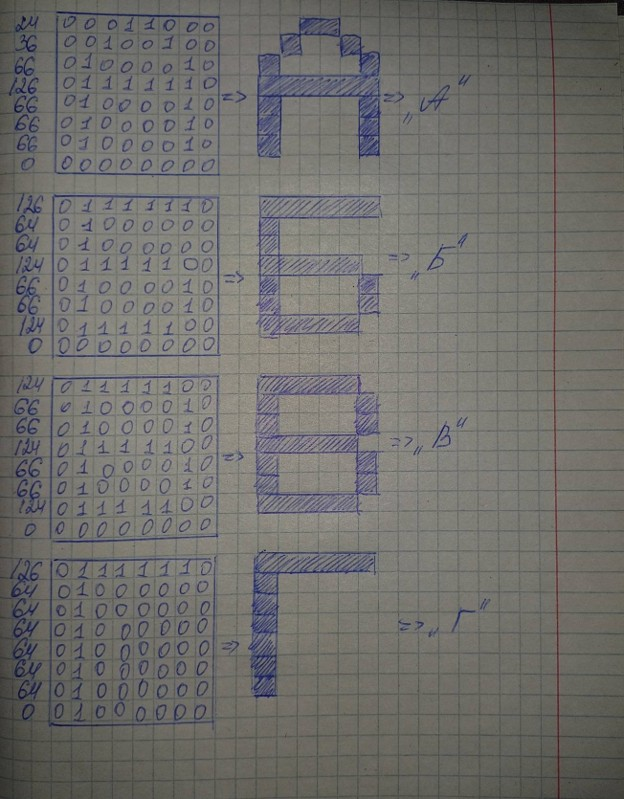

# Игра «Змейка» на базе микроконтроллера ESP32 с использованием OLED-дисплея SSD1306 и аналогового джойстика

## Содержание
- [Собственный шрифт](#собственный-шрифт)
- [Описание уровней](#описание-уровней)
  - [Легкий уровень](#легкий-уровень)
  - [Средний уровень](#средний-уровень)
  - [Сложный уровень](#сложный-уровень)

## Собственный шрифт
- #### Библиотека Adafruit GFX, используемая для работы с OLED-дисплеем, не поддерживает вывод криллицы. Для отображения русскоязычного текста (название игры, меню, статус игры) был разработан собственный растровый шрифт размером 8 на 8 пикселей.
- #### Каждая буква создавалась вручную: на бумаге расчерчивалась сетка 8 на 8, закрашивались нужные пиксели, затем строка за строкой переводилась в двоичное число, которое записывалось в десятичном виде в массив. Все массивы хранятся во flash-памяти с модификатором PROGMEM для экономии оперативной памяти.
- #### Шрифт включает 10 цифр, 33 русские буквы и 2 знака (двоеточие и восклицательный знак). Для вывода чисел реализована функция разбиения на цифры.

## Описание уровней
В работе реализовано три уровня сложности, каждый из которых последовательно усложняет игровой процесс

### Легкий уровень
Легкий уровень предназначен для освоения управления. Змейка перемещается пошагово: одно отклонение джойстика – один шаг. Ограничения отсутствуют: змейка проходит сквозь стены, появляясь с противоположной стороны, и не погибает при столкновении с собой. За каждое съеденное яблоко начисляется 5 очков. Цель – набрать 100 очков.

### Средний уровень
Средний уровень добавляет ограничения: касание границы поля или столкновение с собственным телом приводит к мгновенному проигрышу. Управление остается пошаговым. Яблоки приносят по 10 очков. Цель – набрать 100 очков.

### Сложный уровень
Сложный уровень вводит два новых ограничения. Во-первых, змейка движется автоматически с заданной скоростью – игрок должен вовремя корректировать направление джойстиком. Во-вторых, вместо обычных яблок на поле появляются «хорошие» и «плохие» яблоки. Хорошие яблоки (закрашенные квадраты) приносят 15 очков и увеличивают длину змейки, плохие (пустые квадраты) отнимают 5 очков. Цель – набрать 200 очков.
